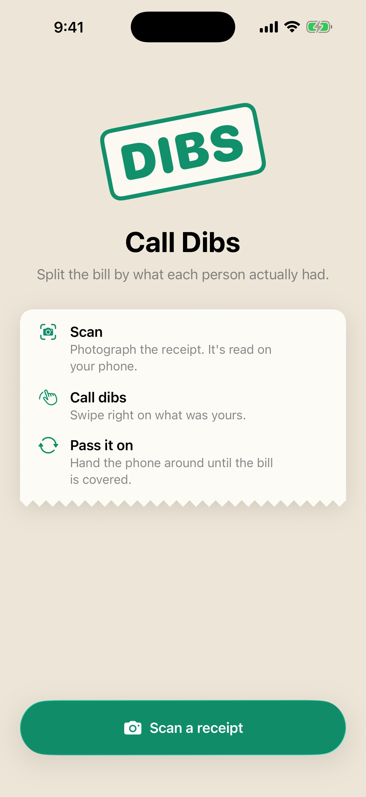
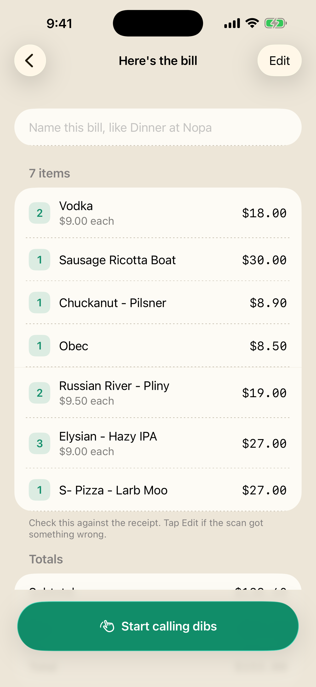
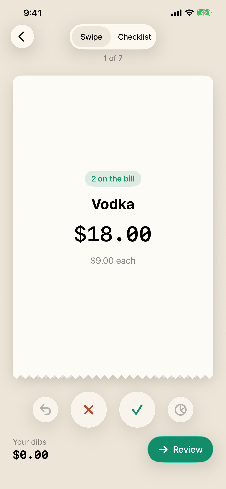
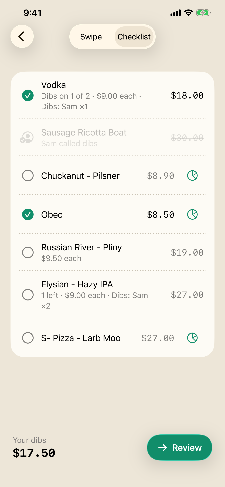

# Call Dibs

An iPhone app that splits a restaurant bill by what each person actually had.
Photograph the receipt, swipe right on what was yours, and pass the phone
around until the bill is covered.

  
  
  
  

## What it does

- **Reads the receipt on the phone.** Apple's Vision framework does the text
  recognition; a parser turns the lines into items, quantities, tax, service
  charges and totals. Nothing is uploaded.
- **Checks its own work.** The items are added up against the subtotal and
  total printed on the receipt, and anything that doesn't reconcile is
  flagged before anyone claims.
- **Splits by who had what.** Each person swipes or ticks off their items.
  Tax and service charges are shared in proportion; everyone sets their own
  tip. Items can be split between people, and leftovers shared out evenly.
- **Gets the payer paid back.** Each person gets a Venmo, Cash App or PayPal
  link with their amount filled in, or the whole split goes to the group chat
  as a picture.
- **Handles other currencies.** The bill's currency is read from the receipt,
  including ones with no decimal places.

No account, no backend, no analytics, no third-party dependencies.

## How it's built

SwiftUI, iOS 26, Swift Package Manager.

| Part | What lives there |
| --- | --- |
| `Packages/DibsCore` | The models, the receipt parser, the share arithmetic and the pay links. Pure Swift with no UI, so it is tested on its own. |
| `Packages/DibsCore/Sources/DibsOCR` | Text recognition with Vision. |
| `Packages/DibsCore/Sources/DibsEval`, `dibs-eval` | A command-line tool that scores the parser against a corpus of labelled receipts, so parser changes can't quietly regress. |
| `Dibs/ViewModels` | `ClaimViewModel`, the one source of claim state, and `AppFlow`, which owns navigation and saving. |
| `Dibs/Views` | The screens and their components. |
| `DibsUITests` | Walkthroughs of every flow that record screenshots and observations. |

Money is `Decimal` throughout and saved as property lists, which keep it
exact. A bill in progress is written to disk as it changes, so it survives
the app being closed.

## Running it

Open `Dibs.xcodeproj` in Xcode 26 and run the `Dibs` scheme. Set your own
development team to run on a device. The project file is generated from
`project.yml` with [XcodeGen](https://github.com/yonaskolb/XcodeGen).

    scripts/test-core.sh        # the DibsCore tests

Debug builds can open on any screen with a sample bill, which is how the UI
tests and screenshots work:

    -seedScreen split           # also: bill, name, swipe, checklist, share

## Privacy and support

- [Privacy policy](https://kevboehm.github.io/calldibs/privacy)
- [Support](https://kevboehm.github.io/calldibs/support)

## License

MIT. See [LICENSE](LICENSE).
